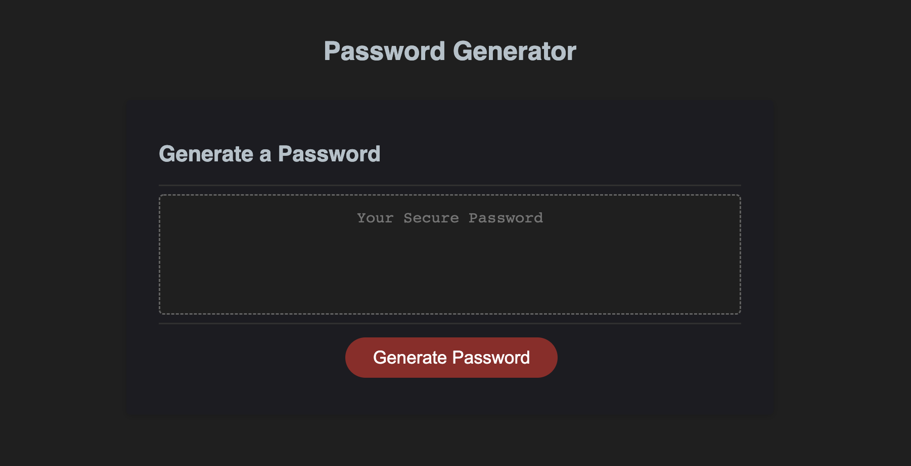
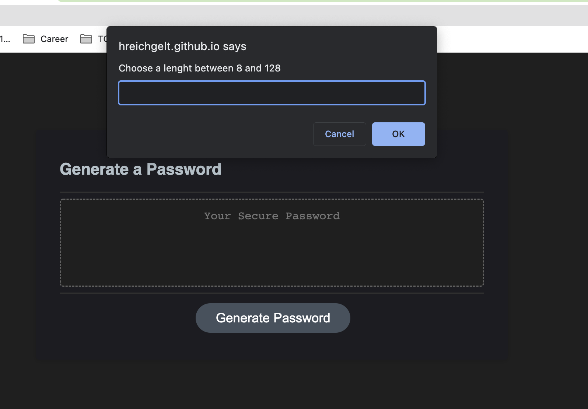
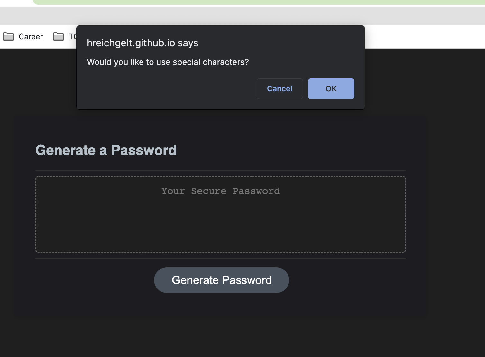
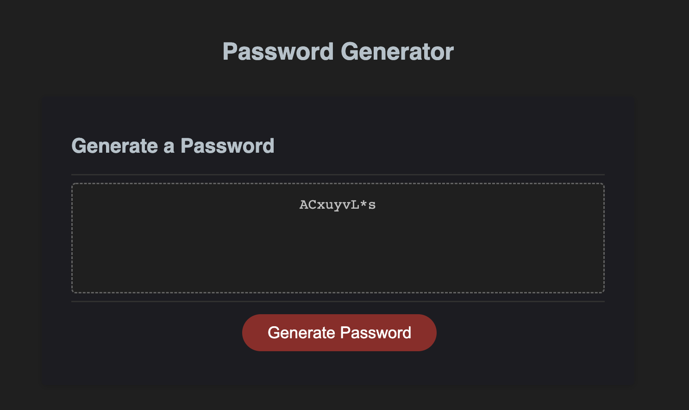

# Password Generator 

A random password generator with customizable criteria so you can create a strong password that provides greater security.

[LIVE SITE](https://hreichgelt.github.io/Password-Generator/)

## TABLE OF CONTENTS

1. [Description](#description)
2. [Usage](#USAGE)
3. [Visuals](#visuals)
4. [Authors Acknowledgments](#authors-and-acknowledgments)
4. [Resources](#resources)

## DESCRIPTION 
This is a page that will generate a random password. The user will be able to select which variables they would like to include. This is using JavaScript variables and functions 

## USAGE 
Click "Generate Password" the page will prompt the user with "choose a length between 8 and 128", where they should enter something in that range. The next confirm if they want numbers. They can either click "OK" (yes), or "Cancel" (No). The next confirm will be for special characters, then capital letters, and finally lowercase letters. Once those steps have been completed, the page will generate a random password with their criteria selected. 

## VISUALS 

## AUTHORS AND ACKNOWLEDGMENTS
Hans Reichgelt
Instructional Staff for coding bootcamp
John Titus - Tutor

## RESOURCES 
1. [LIVE SITE](https://hreichgelt.github.io/Password-Generator/)

2. [REPOSITORY](https://github.com/Hreichgelt/Password-Generator)

